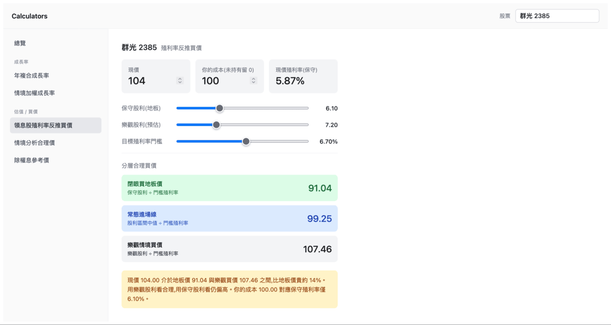

# Calculators

**[▶ Live Demo](https://calculators-nu-sage.vercel.app/)**



一組給投資研究用的小工具集合（殖利率、成長率、除權息、情境估值等）。
以 React + Vite 打造,單頁應用、側邊欄切換,所有計算皆在瀏覽器端完成,不需後端。

A collection of investing calculators. Single-page app with a sidebar; all
computation runs client-side — no backend required.

> Built for my own use as a Taiwan equity investor — a set of calculators I kept
> wanting while researching stocks, gathered into one place.

## Tech stack

| | |
|---|---|
| Framework | React 19 |
| Build tool | Vite 7 |
| Language | Plain JavaScript (`.jsx`) |
| Styling | Inline style objects (no CSS framework) |
| State | Local `useState` (no redux / zustand) |

> Versions are aligned with the `uanalyze_2` project so components can move
> between the two without a React-version mismatch.

## Getting started

Requires Node 18+ (developed on Node 22).

```bash
npm install      # install dependencies
npm run dev      # start dev server → http://localhost:5173/
npm run build    # production build into dist/
npm run preview  # preview the production build locally
```

The dev server has hot-reload — save any file and the browser updates.
If port 5173 is taken, Vite auto-bumps to the next free port and prints the
actual URL in the `➜ Local:` line.

## Calculators

Grouped by purpose in the sidebar; the 總覽 overview lists them all:


**成長率 (Growth rate)**

- **年複合成長率 (CAGR)** — two input modes via a toggle:
  - 期初 / 期末: `(期末 / 期初) ^ (1 / 年) − 1`
  - 逐年成長率: geometric mean of up to 5 yearly rates (≥2 required)
- **情境加權成長率** — probability-weighted growth across 3 scenarios
  (`Σ estimateᵢ × probᵢ / 100`; probabilities must sum to 100%).

**估值 / 買價 (Valuation)**

- **領息股殖利率反推買價** — from a target yield, back out floor / normal /
  optimistic buy prices for a dividend stock.
- **情境分析合理價** — probability-weighted fair price across 3 scenarios
  (same engine as 情境加權成長率, price model).
- **除權息參考價** — `(除權息前股價 − 現金股利) / (1 + 股票股利 / 10)`.

A single stock symbol is shared app-wide (top bar) and shown as a label on
every calculator. Calculators stay mounted while you switch, so each one's
inputs and results are preserved.

## Project structure

```
src/
├── main.jsx                 # entry — mounts <App/>
├── App.jsx                  # shared symbol bar + grouped sidebar + content
├── shared/
│   ├── CalcForm.jsx         # config-driven form (fields + compute + validate)
│   └── format.js            # comma() thousands separator
└── calculators/
    ├── index.js             # registry — groups, order, section titles
    ├── Cagr.jsx
    ├── DividendYieldEntry.jsx
    ├── ExDividends.jsx
    └── WeightedGrowth.jsx    # powers both 情境加權成長率 & 情境分析合理價
```

## Adding a calculator

1. Create a component in `src/calculators/`. It receives a `symbol` prop.
   For a simple input-form calculator, build on `shared/CalcForm.jsx`:

   ```jsx
   import CalcForm from "../shared/CalcForm.jsx";

   export default function MyCalc({ symbol }) {
     return (
       <CalcForm
         symbol={symbol}
         title="我的計算機"
         subtitle="(輸入說明)"
         fields={[{ id: "x", name: "數值", unit: "", required: true }]}
         compute={(v) => [{ label: "結果", value: String(v.x * 2) }]}
       />
     );
   }
   ```

2. Register it in `src/calculators/index.js` under the right group:

   ```js
   { id: "my-calc", title: "我的計算機", Component: MyCalc }
   ```

The sidebar and content area pick it up automatically. Add a new
`{ title, items }` group for a new section.
```
